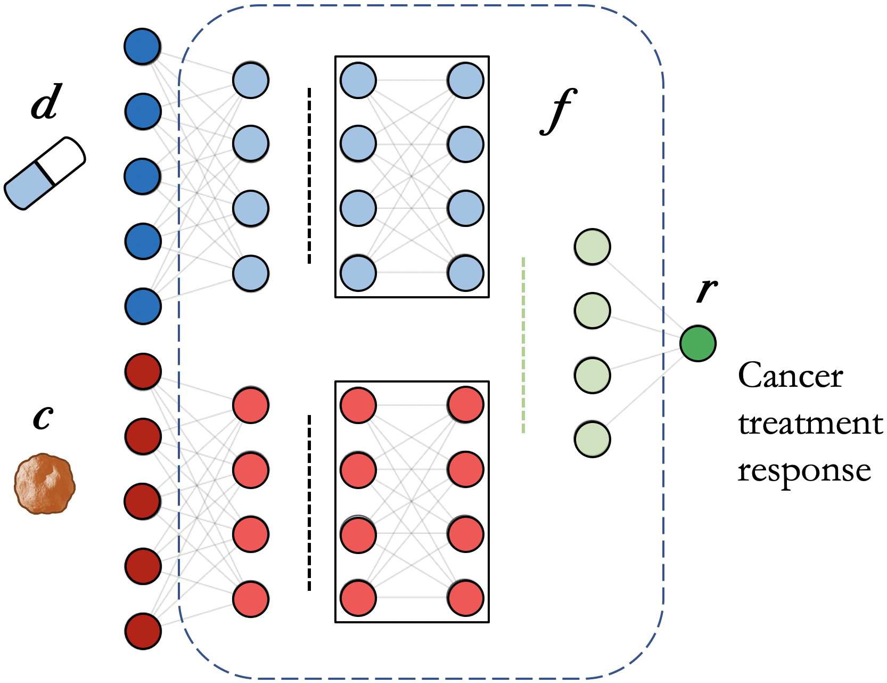
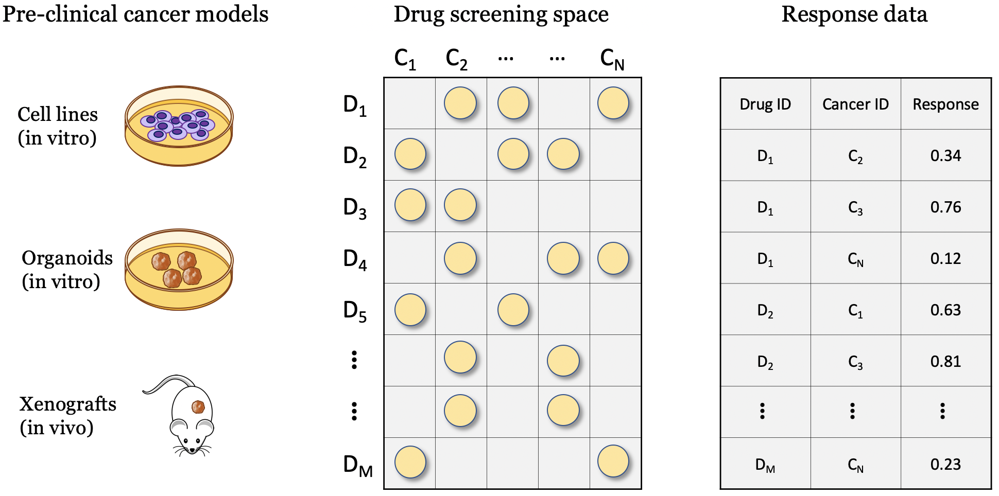
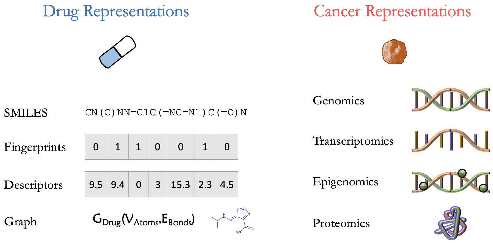
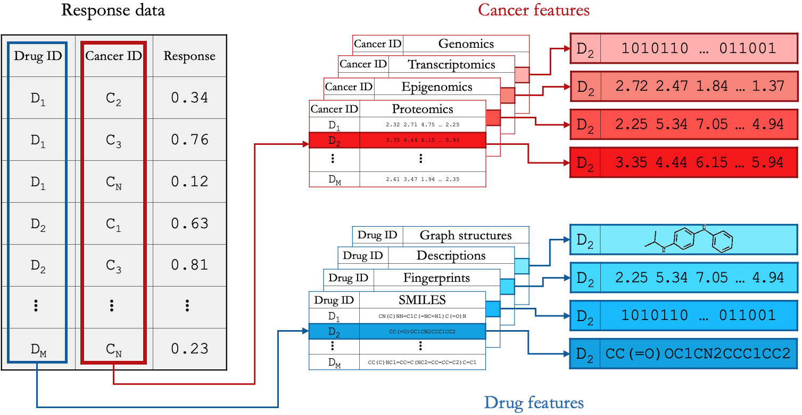

Drug Response Prediction
========================

Modeling drug response
----

.. pan-drug vs multi-drug: https://www.youtube.com/watch?v=Xbd5S3ZnXKQ
A drug response prediction (DRP) model can be represented by :math:`r = f(d, c)`, where :math:`f` is the analytical model designed to predict the response :math:`r` of cancer :math:`c` to the treatment by drug :math:`d`.
The function :math:`f` is implemented with a neural network (NN) architecture.
This formulation is for pan-cancer and pan-drug prediction model where both cancer and drug representations are needed to predict response.
A special case is drug-specific models designed to make predictions for a drug or drug family (e.g., drugs with the same mechanism of action (MoA)). These models learn from cancer features only and can be formulated as :math:`r=f_D(c)`. 

.. https://labs.bilimedtech.com/workshops/rst/writing-rst-6.html

    A neural network architecture for cancer drug response prediction (DRP). The model is pan-cancer and pan-drug where both cancer and drug representations are used to predict the response.

Data
----

Screening data
==============
Drug screening experiments can be performed with various pre-clinical cancer models such as cell lines, organoids, and xenografts, where cancer samples are screened against a library of drug compounds. Regardless of specific cancer models, the screening space can be characterized by the involved drugs and cancers. The 2-D matrix illustrates such a space composed of a finite number of known cancer cases and drugs, where the marked coordinates symbolize that treatment responses are available for these combinations. 
Drug sensitivity results of screening experiments can be organized in a table format, represting the **response data** .

    Drug screening experiments can be performed with several pre-clinical cancer models.

Feature representations
=======================
The different cancers and drugs in a screening experiment can be numerically described using various representations that can be supplied as features to a DL model.
In most DRP models, cancer is represented using various omics data types which are often provided with public drug screening studies (e.g., CCLE, GDSC). In certain cases, however, additional bioinformatics processing steps are applied to further preprocess omics data for the downstream ML analysis. 
The drugs are generallity represtend with SMILES strings, fingerprints, descriptors, and molecular graph structures. These representations can be calculated using open-source cheminformatics software packages such as RDKit and Mordred.

    Several drug and cancer feature representations that are used as input features for a DRP model.

Raw DRP data
============
The data required to develop (train and validate) a pan-cancer and pan-drug DRP model, consists of three primary components: 1) response data, 2) cancer representation, and 3) drug representation.
These data are generally stored in tabular structures.
In the context of the DRP problem, we define these data structures as **raw DRP data**.

    Raw DRP data.

ML data
=======

Deep learning (DL) models built using popular DL frameworks can take various types of data from simple CSV to more complex structures such as TFRecords.
Constructing datasets for DL-based DRP models generally requires combining heterogeneous data such as cancer and drug information and treatment response values.
In this context, we distinguish between two types of data, **raw DRP data** (described above) and **ML data**.
ML data refers to data files that can be directly supplied to DL models for training and testing (e.g., TFRecord files with TensorFlow, **pt** files with PyTorch). Preprocessing scripts are often required to generate ML data from raw data. Note however, not all public repositories provide the necessary scripts.