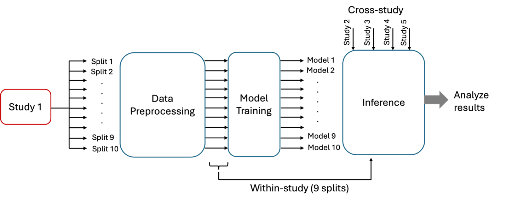

=========================
Cross-Study Analysis
=========================

NATASHA: put real or mock 5x5 table of results under metrics

Cross-Study Analysis (CSA) workflow rigorously compares the ability of models to generalize across different datasets. 
Performance evaluation is conducted to obtain both within-study and cross-study prediction responses. 
The objective of this analysis is to assess the generalization capacity of deep learning models across different studies. 

For the Drug Response Prediction benchmark dataset, CSA compares drug response prediction models' performance across five publicly available cell-line screening studies: CCLE, gCSI, GDSCv1, GDSCv2, and CTRPv2.

Workflow
------------
The figure below shows the workflow for analyzing a single screening study. 
The input data is first divided into 10 sub-datasets, which are then preprocessed to create 10 preprocessed sub-datasets. 
These preprocessed sub-datasets are used to train the deep learning model, resulting in 10 distinct trained models. 
During the inference stage, each trained model is evaluated within the study on the nine sub-datasets not used for training and across the remaining four studies. 
This workflow is repeated for all the screening studies. 

Cross study analysis workflow for analyzing a single study

To implement this workflow with a brute-force approach, see :ref:`<using_csa_bruteforce>`
To implement this workflow at scale with Parsl, see :ref:`<using_csa_parsl>`

Metrics
------------
For each model, the CSA workflow generates an N-by-N table of prediction performance scores (N = number of datasets). 
Scores on the diagonal indicate performance when trained and tested on different splits of the same dataset, whereas off-diagonal scores indicate performance when trained and tested on different datasets

References
------------
`1. <https://aacrjournals.org/cancerres/article/83/7_Supplement/5380/720598>`_ A. Partin et al. "Systematic evaluation and comparison of drug response prediction models: a case study of prediction generalization across cell lines datasets", AACR, 2023  
`2. <https://academic.oup.com/bib/article/23/1/bbab356/6370300>`_ F. Xia et al. "A cross-study analysis of drug response prediction in cancer cell lines", Briefings in Bioinformatics, 2022  
