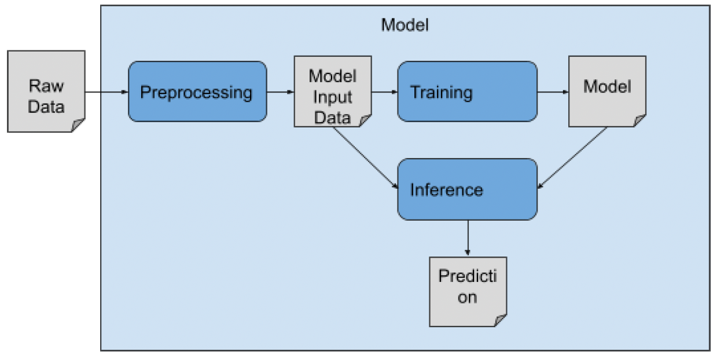

===========================
Unified Interface
===========================

.. TODO. Need to find a name for three steps: step, module, interface, 

IMPROVE comparison workflows require that prediction models conform a unitified code interface.

Supervised learning models generally consist of three primary components: data preparation, model training and hyperparameter optimization, and performance evaluation [`1 <https://www.frontiersin.org/articles/10.3389/fmed.2023.1086097/full>`_].
.. Considering this [observation/phenomenon/norm/tendency/??], we propose/consider to create three separate/disnict modules that form the bulk of the unified interface.
.. Following this [convention/standards/observation/phenomenon/norm/tendency/??], we consider three disnict modules that form the unified interface.
We propose to separate the model code into three distinct interfaces to facilitate code readability, provenance and maintainability.
The first interface handles **preprocessing** of input data, the second is responsible/manages for model **training**, and the third handles/implements/manages model **inference**.
All these should be structured in a modular and flexible way to allow for tractable combination/integration and workflow generation.
.. Separating these steps into three distinct modules aims to facilitate efficient and tractable intergration and designs of workflows.

| Model repositories are required to provide a python script for each of the three steps:
| 1. **Preprocessing.** Preprocessing transforms benchmark *raw data* related to a prediction problem into model specific input data, a.k.a *ML data*. An example of **raw data** :ref:`raw data<ML data>`_ and **ML data** in the context of :ref:`drug response prediction<Drug Response Prediction>` (DRP) are described in applications.
| 2. **Training.** Training and optimization of the model. This often includes hyperparameter optimization and early stopping with validation data to mitigate overfitting [TODO: link to workflow].
| 3. **Inference.** Using the preprocessed data and the trained model to compute predictions and evaluate model prediction performance.

.. It transforms the general format into a model specific format, e.g. csv into hdf5 or pt (if using PyTorch data loaders).
.. This step invloves transforming __raw__ data into data formats that [conform ML/DL frameworks APIs] can supplied to ML models.

    General steps in developing and using prediction model.

..
    In the following [TODO]:
    * Example templates of the three scripts (the use case is drug response prediction)
    * Inputs and outputs (defaults and methods to set the arguments, required and optional)
    * Example with LightGBM
    * Structure of the benchmark dataset

Below we present an example of using `improve lib <https://github.com/JDACS4C-IMPROVE/IMPROVE>`_ for training a `LightGBM <https://lightgbm.readthedocs.io/en/stable/>`_ on :ref:`cross-study analysis benchmark data<Benchmark Data for Cross-Study Analysis>`. The code associated with this example can found in `this repo <https://github.com/JDACS4C-IMPROVE/LGBM/tree/develop>`_.

The implementation of the interfaces requires (at least) four files. Three python scripts (for each of the steps mentioned above) and one text file that contains default parameters to all the three interfaces. 

.. While each of the three interfaces has a unique task, several structures in the interfaces are common to all three modules.

When considering a (specific) scientific application, the code structure across the diffrent prediction models can vary significantly. While the unified interface provides a flexible framework, several ... 

In the code examples below, code sections that is required to be implemented in model are designated with **[Req]**. These sections refer to functionality that models must intergrate in their scripts, specifically using the improve lib functionality.

.. | In the template scripts below, we designate required and optional code sections.
.. * Required sections refer to functionality that models must intergrate in their scripts and specifically use the provided framework functionality (designated with *[Req]*). For example:

.. * Optional sections refer to common steps involved in ML model development that are either optional or implementation depends on the model itself. Optional sections are designated with "[Optional]".

.. The design of code, including keyword arguments and functionality, can be grouped on three levels: framework, scientific problem (e.g., drug response prediction), model (e.g., LightGBM).

.. Find below specifications for each of the three scripts, including examples for utilizing LightGBM for drug response prediction (DRP).

.. There are several components to the model repo:

.. 1. Python scripts for [modelname]_preprocess_improve.py, [modelname]_train_improve.py, [modelname]_inference_improve.py
.. 2. Benchmark data (e.g., CSA data)
.. 3. Parameter file

Preprocessing
---------------------------------
.. https://stackoverflow.com/questions/18632781/how-to-make-an-internal-link-to-a-heading-in-sphinx-restructuredtext-without-cre
This script preprocesses benchmark data (e.g., :ref:`cross-study analysis<Benchmark Data for Cross-Study Analysis>`) and generates data files for a prediction model. The naming convention for the preprocessing script is `MODELNAME_preprocess_improve.py`. For example: `lgbm_preprocess_imporve.py <https://github.com/JDACS4C-IMPROVE/LGBM/blob/master/lgbm_preprocess_improve.py>`_.

| **Outputs from executing preprocessing script**:
All the outputs from the preprocessing script are saved in ``params["ml_data_outdir"]``.

1. **Model input data files.**
    This script creates three data files corresponding to train, validation, and test data.
    These data files are used as inputs to the ML/DL prediction model in the :ref:`training <Training>` and :ref:`inference <Inference>` scripts.
    The way that data is structured in these data files is highly depedent on the prediction model. Therefore, the :ref:`training <Training>` and :ref:`inference <Inference>` scripts should provide and utilize appropriate functionality (data loaders) to load the data and pass it to the model.
    The file format is specified by ``params["data_format"]``.
    For example:
        | for LightGBM model: ``train_data.csv``, ``val_data.csv``, ``test_data.csv``
        | for GraphDRP model: ``train_data.pt``, ``val_data.pt``, ``test_data.pt``
    Note that in addition to the required three data files, the preprocessing script can save additional utility data required by the data loader for a given model.

2. **Y data files.**
    The script creates dataframes with true Y values and additional metadata.
    The script generates (regardless for the prediction model):
        ``train_y_data.csv``, ``val_y_data.csv``, and ``test_y_data.csv``.

Below is a preprocessing script that takes :ref:`cross-study analysis benchmark data<Benchmark Data for Cross-Study Analysis>` and generates training, validation, and test files. This script is available in this `repo <https://github.com/JDACS4C-IMPROVE/LGBM/blob/master/lgbm_preprocess_improve.py>`_. Another example for a preprocessing script can be found in the `repo <https://github.com/JDACS4C-IMPROVE/GraphDRP/blob/develop/graphdrp_preprocess_improve.py>`_ for DL model, GraphDRP.

.. code-block:: python

    import sys
    from pathlib import Path
    from typing import Dict

    import pandas as pd
    import joblib

    # [Req] IMPROVE/CANDLE imports
    from improve import framework as frm
    from improve import drug_resp_pred as drp

    # Model-specifc imports
    from model_utils.utils import gene_selection, scale_df

    filepath = Path(__file__).resolve().parent # [Req]

    # ---------------------
    # [Req] Parameter lists
    # ---------------------
    # Two parameter lists are required:
    # 1. app_preproc_params
    # 2. model_preproc_params
    # 
    # The values for the parameters in both lists should be specified in a
    # parameter file that is passed as default_model arg in
    # frm.initialize_parameters().

    # 1. App-specific params (App: monotherapy drug response prediction)
    # Note! This list should not be modified (i.e., no params should added or
    # removed from the list.
    # 
    # There are two types of params in the list: default and required
    # default:   default values should be used
    # required:  these params must be specified for the model in the param file
    app_preproc_params = [
    {"name": "y_data_files", # default
        "type": str,
        "help": "List of files that contain the y (prediction variable) data. \
                Example: [['response.tsv']]",
    },
    {"name": "x_data_canc_files", # required
        "type": str,
        "help": "List of feature files including gene_system_identifer. Examples: \n\
                1) [['cancer_gene_expression.tsv', ['Gene_Symbol']]] \n\
                2) [['cancer_copy_number.tsv', ['Ensembl', 'Entrez']]].",
    },
    {"name": "x_data_drug_files", # required
        "type": str,
        "help": "List of feature files. Examples: \n\
                1) [['drug_SMILES.tsv']] \n\
                2) [['drug_SMILES.tsv'], ['drug_ecfp4_nbits512.tsv']]",
    },
    {"name": "canc_col_name",
        "default": "improve_sample_id", # default
        "type": str,
        "help": "Column name in the y (response) data file that contains the cancer sample ids.",
    },
    {"name": "drug_col_name", # default
        "default": "improve_chem_id",
        "type": str,
        "help": "Column name in the y (response) data file that contains the drug ids.",
    },
    ]

    # 2. Model-specific params (Model: LightGBM)
    # All params in model_preproc_params are optional.
    # If no params are required by the model, then it should be an empty list.
    model_preproc_params = [
    {"name": "use_lincs",
        "type": frm.str2bool,
        "default": True,
        "help": "Flag to indicate if landmark genes are used for gene selection.",
    },
    {"name": "scaling",
        "type": str,
        "default": "std",
        "choice": ["std", "minmax", "miabs", "robust"],
        "help": "Scaler for gene expression and Mordred descriptors data.",
    },
    {"name": "ge_scaler_fname",
        "type": str,
        "default": "x_data_gene_expression_scaler.gz",
        "help": "File name to save the gene expression scaler object.",
    },
    {"name": "md_scaler_fname",
        "type": str,
        "default": "x_data_mordred_scaler.gz",
        "help": "File name to save the Mordred scaler object.",
    },
    ]

    # [Req] Combine the two lists (the combined parameter list will be passed to
    # frm.initialize_parameters() in the main().
    preprocess_params = app_preproc_params + model_preproc_params
    # req_preprocess_params = []
    # ---------------------

    # [Req]
    def run(params: Dict):
    """ Run data preprocessing.

    Args:
        params (dict): dict of CANDLE/IMPROVE parameters and parsed values.

    Returns:
        str: directory name that was used to save the preprocessed (generated)
            ML data files.
    """

    # ------------------------------------------------------
    # [Req] Build paths and create output dir
    # ------------------------------------------------------
    # Build paths for raw_data, x_data, y_data, splits
    params = frm.build_paths(params)  

    # Create output dir for model input data (to save preprocessed ML data)
    frm.create_outdir(outdir=params["ml_data_outdir"])

    # ------------------------------------------------------
    # [Req] Load X data (feature representations)
    # ------------------------------------------------------
    # Use the provided data loaders to load data that is required by the model.
    #
    # Benchmark data includes three dirs: x_data, y_data, splits.
    # The x_data contains files that represent feature information such as
    # cancer representation (e.g., omics) and drug representation (e.g., SMILES).
    #
    # Prediction models utilize various types of feature representations.
    # Drug response prediction (DRP) models generally use omics and drug features.
    #
    # If the model uses omics data types that are provided as part of the benchmark
    # data, then the model must use the provided data loaders to load the data files
    # from the x_data dir.
    print("\nLoads omics data.")
    omics_obj = drp.OmicsLoader(params)
    # print(omics_obj)
    ge = omics_obj.dfs['cancer_gene_expression.tsv'] # return gene expression

    print("\nLoad drugs data.")
    drugs_obj = drp.DrugsLoader(params)
    # print(drugs_obj)
    md = drugs_obj.dfs['drug_mordred.tsv'] # return the Mordred descriptors
    md = md.reset_index()  # TODO. implement reset_index() inside the loader

    # ------------------------------------------------------
    # Further preprocess X data
    # ------------------------------------------------------
    # Gene selection (based on LINCS landmark genes)
    if params["use_lincs"]:
        genes_fpath = filepath/"landmark_genes"
        ge = gene_selection(ge, genes_fpath, canc_col_name=params["canc_col_name"])

    # Prefix gene column names with "ge."
    fea_sep = "."
    fea_prefix = "ge"
    ge = ge.rename(columns={fea: f"{fea_prefix}{fea_sep}{fea}" for fea in ge.columns[1:]})

    # ------------------------------------------------------
    # Create feature scaler
    # ------------------------------------------------------
    # Load and combine responses
    print("Create feature scaler.")
    rsp_tr = drp.DrugResponseLoader(params,
                                    split_file=params["train_split_file"],
                                    verbose=False).dfs["response.tsv"]
    rsp_vl = drp.DrugResponseLoader(params,
                                    split_file=params["val_split_file"],
                                    verbose=False).dfs["response.tsv"]
    rsp = pd.concat([rsp_tr, rsp_vl], axis=0)

    # Retian feature rows that are present in the y data (response dataframe)
    # Intersection of omics features, drug features, and responses
    rsp = rsp.merge(ge[params["canc_col_name"]], on=params["canc_col_name"], how="inner")
    rsp = rsp.merge(md[params["drug_col_name"]], on=params["drug_col_name"], how="inner")
    ge_sub = ge[ge[params["canc_col_name"]].isin(rsp[params["canc_col_name"]])].reset_index(drop=True)
    md_sub = md[md[params["drug_col_name"]].isin(rsp[params["drug_col_name"]])].reset_index(drop=True)

    # Scale gene expression
    _, ge_scaler = scale_df(ge_sub, scaler_name=params["scaling"])
    ge_scaler_fpath = Path(params["ml_data_outdir"]) / params["ge_scaler_fname"]
    joblib.dump(ge_scaler, ge_scaler_fpath)
    print("Scaler object for gene expression: ", ge_scaler_fpath)

    # Scale Mordred descriptors
    _, md_scaler = scale_df(md_sub, scaler_name=params["scaling"])
    md_scaler_fpath = Path(params["ml_data_outdir"]) / params["md_scaler_fname"]
    joblib.dump(md_scaler, md_scaler_fpath)
    print("Scaler object for Mordred:         ", md_scaler_fpath)

    del rsp, rsp_tr, rsp_vl, ge_sub, md_sub

    # ------------------------------------------------------
    # [Req] Construct ML data for every stage (train, val, test)
    # ------------------------------------------------------
    # All models must load response data (y data) using DrugResponseLoader().
    # Below, we iterate over the 3 split files (train, val, test) and load
    # response data, filtered by the split ids from the split files.

    # Dict with split files corresponding to the three sets (train, val, and test)
    stages = {"train": params["train_split_file"],
                "val": params["val_split_file"],
                "test": params["test_split_file"]}

    for stage, split_file in stages.items():

        # --------------------------------
        # [Req] Load response data
        # --------------------------------
        rsp = drp.DrugResponseLoader(params,
                                        split_file=split_file,
                                        verbose=False).dfs["response.tsv"]

        # --------------------------------
        # Data prep
        # --------------------------------
        # Retain (canc, drug) responses for which both omics and drug features
        # are available.
        rsp = rsp.merge(ge[params["canc_col_name"]], on=params["canc_col_name"], how="inner")
        rsp = rsp.merge(md[params["drug_col_name"]], on=params["drug_col_name"], how="inner")
        ge_sub = ge[ge[params["canc_col_name"]].isin(rsp[params["canc_col_name"]])].reset_index(drop=True)
        md_sub = md[md[params["drug_col_name"]].isin(rsp[params["drug_col_name"]])].reset_index(drop=True)

        # Scale features
        ge_sc, _ = scale_df(ge_sub, scaler=ge_scaler) # scale gene expression
        md_sc, _ = scale_df(md_sub, scaler=md_scaler) # scale Mordred descriptors
        # print("GE mean:", ge_sc.iloc[:,1:].mean(axis=0).mean())
        # print("GE var: ", ge_sc.iloc[:,1:].var(axis=0).mean())
        # print("MD mean:", md_sc.iloc[:,1:].mean(axis=0).mean())
        # print("MD var: ", md_sc.iloc[:,1:].var(axis=0).mean())

        # --------------------------------
        # [Req] Save ML data files in params["ml_data_outdir"]
        # The implementation of this step, depends on the model.
        # --------------------------------
        # [Req] Build data name
        data_fname = frm.build_ml_data_name(params, stage)

        print("Merge data")
        data = rsp.merge(ge_sc, on=params["canc_col_name"], how="inner")
        data = data.merge(md_sc, on=params["drug_col_name"], how="inner")
        data = data.sample(frac=1.0).reset_index(drop=True) # shuffle

        print("Save data")
        data = data.drop(columns=["study"]) # to_parquet() throws error since "study" contain mixed values
        data.to_parquet(Path(params["ml_data_outdir"])/data_fname) # saves ML data file to parquet

        # Prepare the y dataframe for the current stage
        fea_list = ["ge", "mordred"]
        fea_cols = [c for c in data.columns if (c.split(fea_sep)[0]) in fea_list]
        meta_cols = [c for c in data.columns if (c.split(fea_sep)[0]) not in fea_list]
        ydf = data[meta_cols]

        # [Req] Save y dataframe for the current stage
        frm.save_stage_ydf(ydf, params, stage)

    return params["ml_data_outdir"]

    # [Req]
    def main(args):
        # [Req]
        additional_definitions = preprocess_params
        params = frm.initialize_parameters(
            filepath,
            default_model="lgbm_params.txt",
            additional_definitions=additional_definitions,
            required=None,
        )
        ml_data_outdir = run(params)
        print("\nFinished data preprocessing.")

    # [Req]
    if __name__ == "__main__":
        main(sys.argv[1:])

As mentioned earlier, all the required sections in the code are designated with **[Req]**.
One of the requirements is to create two lists of directories. Each dict specifies keyword arguments. Both lists must be defined in the script.
.. Here we elaborate the details for this requirement.

The values for the parameters in both lists should be specified in a parameter file that is passed as ``default_model`` arg in ``frm.initialize_parameters()``.

| Note that ``app_preproc_params`` list should not be modified (i.e., no params should added or removed from the list). There are two types of params in the list: default and required.
* default:   default values should be used
* required:  these params must be specified for the model in the param file

.. code-block:: python
    
    app_preproc_params = [
    {"name": "y_data_files", # default
        "type": str,
        "help": "List of files that contain the y (prediction variable) data. \
                Example: [['response.tsv']]",
    },
    {"name": "x_data_canc_files", # required
        "type": str,
        "help": "List of feature files including gene_system_identifer. Examples: \n\
                1) [['cancer_gene_expression.tsv', ['Gene_Symbol']]] \n\
                2) [['cancer_copy_number.tsv', ['Ensembl', 'Entrez']]].",
    },
    {"name": "x_data_drug_files", # required
        "type": str,
        "help": "List of feature files. Examples: \n\
                1) [['drug_SMILES.tsv']] \n\
                2) [['drug_SMILES.tsv'], ['drug_ecfp4_nbits512.tsv']]",
    },
    {"name": "canc_col_name",
        "default": "improve_sample_id", # default
        "type": str,
        "help": "Column name in the y (response) data file that contains the cancer sample ids.",
    },
    {"name": "drug_col_name", # default
        "default": "improve_chem_id",
        "type": str,
        "help": "Column name in the y (response) data file that contains the drug ids.",
    },
    ]

All params in ``model_preproc_params`` are optional. If no params are required by the model, then it should be an empty list.

.. code-block:: python

    model_preproc_params = [
        {"name": "use_lincs",
        "type": frm.str2bool,
        "default": True,
        "help": "Flag to indicate if landmark genes are used for gene selection.",
        },
        {"name": "scaling",
        "type": str,
        "default": "std",
        "choice": ["std", "minmax", "miabs", "robust"],
        "help": "Scaler for gene expression and Mordred descriptors data.",
        },
        {"name": "ge_scaler_fname",
        "type": str,
        "default": "x_data_gene_expression_scaler.gz",
        "help": "File name to save the gene expression scaler object.",
        },
        {"name": "md_scaler_fname",
        "type": str,
        "default": "x_data_mordred_scaler.gz",
        "help": "File name to save the Mordred scaler object.",
        },
    ]

Training
---------------------------------
The training script is used for executing model training as well as conducting :ref:`hyperparameter optimization (HPO) <Hyper Parameter Optimization (HPO)¶>`_. The script generates a trained model, and raw model predictions and prediction performance scores calculated using the validation data. The naming convention for the training script is `MODELNAME_train_improve.py`. For example: `lgbm_train_imporve.py <https://github.com/JDACS4C-IMPROVE/LGBM/blob/master/lgbm_train_improve.py>`_.

| **Outputs from executing the training script:**
All the outputs from the training script are saved in ``params["model_outdir"]``.

1. **Trained model.**
   The training script loads the training and validation data that were generated during the :ref:`preprocessing <Preprocessing>` step.
   The training data is used for model training and validation data is used for early stopping.
   When the model converges (i.e., prediction performance stopped improving on validation data), the model is saved into a file.
   The model file name and file format are specified, respectively by ``params["model_file_name"]`` and ``params["model_file_format"]``.
   For example:
        | for LightGBM model: ``model.txt``
        | for GraphDRP model: ``model.pt``

2. **Predictions on validation data.**
   Raw model predictions calcualted using the trained model on validation data.
   The predictions are saved as a dataframe in ``val_y_data_predicted.csv``

3. **Prediction performance scores on validation data.**
   The performance scores are calculated using the raw model predictions and the true Y values for the performance metrics specified in the ``metrics_list``.
   The scores are saved as json in ``val_scores.json``.

Below is a training script that takes the generated data from the :ref:`preprocessing <Preprocessing>` step and train a LightGBM model. This script is available in this `repo <https://github.com/JDACS4C-IMPROVE/LGBM/blob/master/lgbm_train_improve.py>`_. Another example for a training script can be found in a `repo <https://github.com/JDACS4C-IMPROVE/GraphDRP/blob/develop/graphdrp_train_improve.py>`_ for the GraphDRP model.

.. code-block:: python

    import sys
    from pathlib import Path
    from typing import Dict

    import pandas as pd

    import lightgbm as lgb

    # [Req] IMPROVE/CANDLE imports
    from improve import framework as frm
    # from improve.metrics import compute_metrics

    # Model-specifc imports
    from model_utils.utils import extract_subset_fea

    # [Req] Imports from preprocess script
    from lgbm_preprocess_improve import preprocess_params

    filepath = Path(__file__).resolve().parent # [Req]

    # ---------------------
    # [Req] Parameter lists
    # ---------------------
    # Two parameter lists are required:
    # 1. app_train_params
    # 2. model_train_params
    # 
    # The values for the parameters in both lists should be specified in a
    # parameter file that is passed as default_model arg in
    # frm.initialize_parameters().

    # 1. App-specific params (App: monotherapy drug response prediction)
    # Currently, there are no app-specific params for this script.
    app_train_params = []

    # 2. Model-specific params (Model: LightGBM)
    # All params in model_train_params are optional.
    # If no params are required by the model, then it should be an empty list.
    model_train_params = [
        {"name": "learning_rate",
        "type": float,
        "default": 0.1,
        "help": "Learning rate for the optimizer."
        },
    ]

    # Combine the two lists (the combined parameter list will be passed to
    # frm.initialize_parameters() in the main().
    train_params = app_train_params + model_train_params
    # ---------------------

    # [Req] List of metrics names to compute prediction performance scores
    metrics_list = ["mse", "rmse", "pcc", "scc", "r2"]  

    # [Req]
    def run(params: Dict):
        """ Run model training.

        Args:
            params (dict): dict of CANDLE/IMPROVE parameters and parsed values.

        Returns:
            dict: prediction performance scores computed on validation data
                according to the metrics_list.
        """
        # ------------------------------------------------------
        # [Req] Create output dir and build model path
        # ------------------------------------------------------
        # Create output dir for trained model, val set predictions, val set
        # performance scores
        frm.create_outdir(outdir=params["model_outdir"])

        # Build model path
        modelpath = frm.build_model_path(params, model_dir=params["model_outdir"])

        # ------------------------------------------------------
        # [Req] Create data names for train and val sets
        # ------------------------------------------------------
        train_data_fname = frm.build_ml_data_name(params, stage="train")
        val_data_fname = frm.build_ml_data_name(params, stage="val")

        # ------------------------------------------------------
        # Load model input data (ML data)
        # ------------------------------------------------------
        tr_data = pd.read_parquet(Path(params["train_ml_data_dir"])/train_data_fname)
        vl_data = pd.read_parquet(Path(params["val_ml_data_dir"])/val_data_fname)

        fea_list = ["ge", "mordred"]
        fea_sep = "."

        # Train data
        xtr = extract_subset_fea(tr_data, fea_list=fea_list, fea_sep=fea_sep)
        ytr = tr_data[[params["y_col_name"]]]
        print("xtr:", xtr.shape)
        print("ytr:", ytr.shape)

        # Val data
        xvl = extract_subset_fea(vl_data, fea_list=fea_list, fea_sep=fea_sep)
        yvl = vl_data[[params["y_col_name"]]]
        print("xvl:", xvl.shape)
        print("yvl:", yvl.shape)

        # ------------------------------------------------------
        # Prepare, train, and save model
        # ------------------------------------------------------
        # Prepare model and train settings
        ml_init_args = {'n_estimators': 1000, 'max_depth': -1,
                        'learning_rate': params["learning_rate"],
                        'num_leaves': 31, 'n_jobs': 8, 'random_state': None}
        model = lgb.LGBMRegressor(objective='regression', **ml_init_args)

        # Train model
        ml_fit_args = {'verbose': False, 'early_stopping_rounds': 50}
        ml_fit_args['eval_set'] = (xvl, yvl)
        model.fit(xtr, ytr, **ml_fit_args)

        # Save model
        model.booster_.save_model(str(modelpath))
        del model

        # ------------------------------------------------------
        # Load best model and compute predictions
        # ------------------------------------------------------
        # Load the best saved model (as determined based on val data)
        model = lgb.Booster(model_file=str(modelpath))

        # Compute predictions
        val_pred = model.predict(xvl)
        val_true = yvl.values.squeeze()
    
        # ------------------------------------------------------
        # [Req] Save raw predictions in dataframe
        # ------------------------------------------------------
        frm.store_predictions_df(
            params,
            y_true=val_true, y_pred=val_pred, stage="val",
            outdir=params["model_outdir"]
        )

        # ------------------------------------------------------
        # [Req] Compute performance scores
        # ------------------------------------------------------
        val_scores = frm.compute_performace_scores(
            params,
            y_true=val_true, y_pred=val_pred, stage="val",
            outdir=params["model_outdir"], metrics=metrics_list
        )

        return val_scores

    # [Req]
    def main(args):
        # [Req]
        additional_definitions = preprocess_params + train_params
        params = frm.initialize_parameters(
            filepath,
            default_model="lgbm_params.txt",
            additional_definitions=additional_definitions,
            required=None,
        )
        val_scores = run(params)
        print("\nFinished model training.")

    # [Req]
    if __name__ == "__main__":
        main(sys.argv[1:])

Similar to the preprocessing script, the training script also requires to define two lists: ``app_train_params`` and ``model_train_params``.

.. code-block:: python

    # 1. App-specific params (App: monotherapy drug response prediction)
    # Currently, there are no app-specific params for this script.
    app_train_params = []

    # 2. Model-specific params (Model: LightGBM)
    # All params in model_train_params are optional.
    # If no params are required by the model, then it should be an empty list.
    model_train_params = [
        {"name": "learning_rate",
        "type": float,
        "default": 0.1,
        "help": "Learning rate for the optimizer."
        },
    ]

Inference
---------------------------------
* Script name: `MODELNAME_infer_improve.py`. For example: `lgbm_infer_imporve.py`
* Import the `imporve` library and the python module `drug_resp_pred`

We saw in the previous example how to create a candle benchmark. Now we will use
the ``candle.file_utils`` methods to set up our input and output directories. Building
on the previous example, we will extend our Example model to load data. The general
functionality is that if the data exists in the data directory, use it, otherwise download
it and then use it.

----

.. code-block:: python

    from improve import framework as frm
    from improve import drug_resp_pred as drp

    # Set up input and output directory paths. These will always be
    # relative to os.environ['CANDLE_DATA_DIR'].
    data_dir = gParameters["data_dir"]
    output_dir = gParameters["output_dir"]
    # the following is incorrect and appends extra subdirectories to the path
    # data_dir, output_dir = directory_tree_from_parameters(gParameters)
    print('data_dir: {}\noutput_dir: {}'.format(data_dir, output_dir))

    # prints:
    # data_dir:   /tmp/improve_data_dir/Example/Data
    # putput_dir: /tmp/improve_data_dir/Example/Output/EXP000/RUN000

    # Get machine learning data
    download_filepath = candle.get_file(
        gParameters['train_data'],
        gParameters['data_url'] + "/" + gParameters['train_data']
        datadir = data_dir  # This puts the files in correct path
        cache_subdir = None  # This prevents get_file from creating another subdirectory
    )
    print('download_path: {}'.format(download_filepath))

    # prints:
    # download_path: /tmp/improve_data_dir/Example/Data/example.csv

----

The code above uses the environment variable CANDLE_DATA_DIR as the root to all input
and output paths.

Two new keyword = value pairs are needed in the default model file - ``example_default_model.txt``. These are
``data_url`` and ``train_data``. Additionally, I had to upload ``example.csv`` to
https://ftp.mcs.anl.gov/pub/candle/public/improve/examples

.. code-block:: text
    
    # set location and name of training data
    data_url="https://ftp.mcs.anl.gov/pub/candle/public/improve/examples"
    train_data="example.csv"

----

Putting this together into a running example looks like this:

.. code-block:: python

    import os
    import candle
    # from candle.file_utils import directory_tree_from_parameters
    # from candle.file_utils import get_file
    # from candle import Benchmark
    # from candle import finalize_parameters

    # set CANDLE_DATA_DIR env var. This is normally set externally.
    os.environ['CANDLE_DATA_DIR'] = '/tmp/improve_data_dir'

    # get the directory of this script, so that the default_model.txt
    # file can be found when the benchmark is instanciated.
    filepath = os.path.dirname(os.path.abspath(__file__))

    imp_bmk=candle.Benchmark(
        filepath=filepath,
        defmodel="example_default_model.txt",
        framework="tensorflow"
    )

    # Initialize parameters
    gParameters = candle.finalize_parameters(imp_bmk)

    # Set up input and output directory paths. These will always be
    # relative to os.environ['CANDLE_DATA_DIR'].
    # data_dir, output_dir = directory_tree_from_parameters(gParameters)
    print('data_dir: {}\noutput_dir: {}'.format(gParameters{"data_dir"], gParameters{"output_dir"]))

    # data_dir:   /tmp/improve_data_dir/Example/Data
    # putput_dir: /tmp/improve_data_dir/Example/Output/EXP000/RUN000

    # Get machine learning data
    download_filepath = candle.get_file(
        gParameters['train_data'],
        gParameters['data_url'] + "/" + gParameters['train_data']
        datadir = data_dir  # This puts the files in correct path
        cache_subdir = None  # This prevents get_file from creating another subdirectory
    )
    print('download_path: {}'.format(download_filepath))

This code produces the following output. The first output, model_name and Params come
from the call to finalize_parameters. The rest is print statements in the code above.

.. code-block:: text
    
 $ python ./example.py
 
 model name:  "Example"

 Params:
 {'ckpt_checksum': False,
 'ckpt_directory': './save',
 'ckpt_keep_limit': 1000000,
 'ckpt_keep_mode': 'linear',
 'ckpt_restart_mode': 'auto',
 'ckpt_save_best': True,
 'ckpt_save_best_metric': 'val_loss',
 'ckpt_save_interval': 0,
 'ckpt_save_weights_only': False,
 'ckpt_skip_epochs': 0,
 'data_dir': '/tmp/improve_data_dir/Example/Data',
 'data_type': <class 'numpy.float32'>,
 'data_url': 'https://ftp.mcs.anl.gov/pub/candle/public/improve/examples',
 'experiment_id': 'EXP000',
 'logfile': None,
 'model_name': 'Example',
 'output_dir': '/tmp/improve_data_dir/Example/Output/EXP000/RUN000',
 'profiling': False,
 'rng_seed': 7102,
 'run_id': 'RUN000',
 'shuffle': False,
 'timeout': -1,
 'train_bool': True,
 'train_data': 'example.csv',
 'verbose': False}

 data_dir: /tmp/improve_data_dir/Example/Data
 output_dir: /tmp/improve_data_dir/Example/Output/EXP000/RUN000
 download_path: /tmp/improve_data_dir/Example/Data/example.csv

The code for this example can be found at https://github.com/JDACS4C-IMPROVE/docs/tree/main/example_code
in the example.py and example_default_model.txt files.

Parameter file
---------------------------------
This is a `txt` file that contain default parameters for all three modules.

.. How to do a text block -- copy here the 

References
---------------------------------
`1. <https://www.frontiersin.org/articles/10.3389/fmed.2023.1086097/full>`_ A. Partin et al. "Deep learning methods for drug response prediction in cancer: Predominant and emerging trends", Frontiers in Medicine, Section Prediction Oncology, 2023