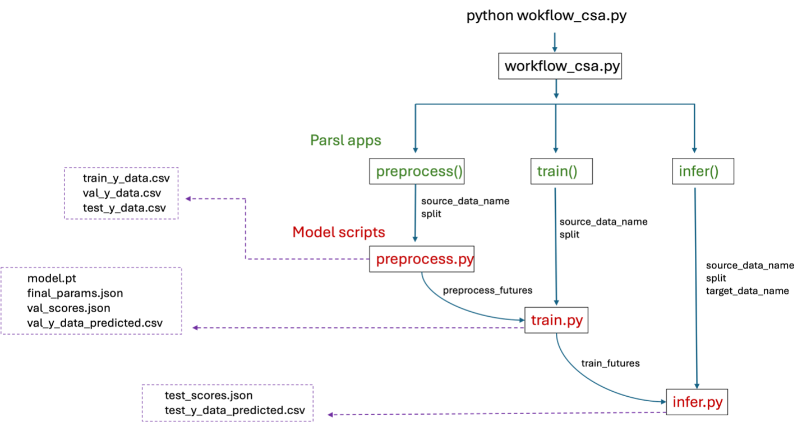

Scaling Cross-Study Analysis with Parsl
=========================================

NATASHA: ask Priyanka about analysis steps

The concept behind Cross-Study Analysis (CSA) is detailed :ref:`here<eval_csa>`. 
To enable parallel execution, Parsl parallel processing library [1] is used to implement the cross-study analysis workflow. 
The figure below illustrates the cross-study workflow with Parsl. The main components of the workflow - preprocess, train and infer - are implemented as Parsl apps, each returning ‘futures’ that monitor progress of the execution. 
For example, once preprocessing for CCLE split 1 is complete, the corresponding ‘preprocess_futures’ will trigger training for CCLE split 1. Inference begins after training, as indicated by ‘train_futures’. 
Parsl also allow parallel execution using multiple GPUs, as specified by the user. 
The cross-study analysis workflow using Parsl has been successfully implemented on the GraphDRP model using multiple GPUs on the Lambda machine managed by CELS at Argonne National Laboratory.

Cross-study analysis workflow using Parsl parallel processing library

1. Clone the GraphDRP repo

.. code-block:: bash

  git clone https://github.com/JDACS4C-IMPROVE/GraphDRP.git
  cd GraphDRP
  git checkout framework-api

2. Clone IMPROVE repo
Clone the `IMPROVE library` repository to a directory of your preference (outside of your drug response prediction (DRP) model's directory).

.. code-block:: bash

  git clone https://github.com/JDACS4C-IMPROVE/IMPROVE
  cd IMPROVE
  git checkout framework-api

3. Install Dependencies
Create conda env using :code:`env_gdrp_37_improve.yml` and activate the environment

.. code-block:: bash

  conda env create -f env_gdrp_37_improve.yml
  conda activate graphdrp_py37_improve

4. Install Parsl (2023.6.19):

.. code-block:: bash

  pip install parsl 

If you see an error during execution you may have to do this:

.. code-block:: bash

  export LD_PRELOAD=/usr/lib/x86_64-linux-gnu/libffi.so.7

5. Set PYTHONPATH and download benchmark data

.. code-block:: bash

  source setup_improve.sh

This will set up :code:`PYTHONPATH` to point the IMPROVE repo, and download cross-study benchmark data into :code:`./csa_data/`.

6. Run cross study analysis using PARSL:

csa_params.ini contains parameters necessary for the workflow. However, please change the source_datasets, target_datasets, split, epochs within workflow_csa.py script. Run this for cross study analysis:

.. code-block:: bash

  python workflow_csa.py

References
------------
`1. <https://dl.acm.org/doi/10.1145/3307681.3325400>`_ Y. Babuji et al. "Parsl: Pervasive Parallel Programming in Python", 28th ACM International Symposium on High-Performance Parallel and Distributed Computing (HPDC), 2019

