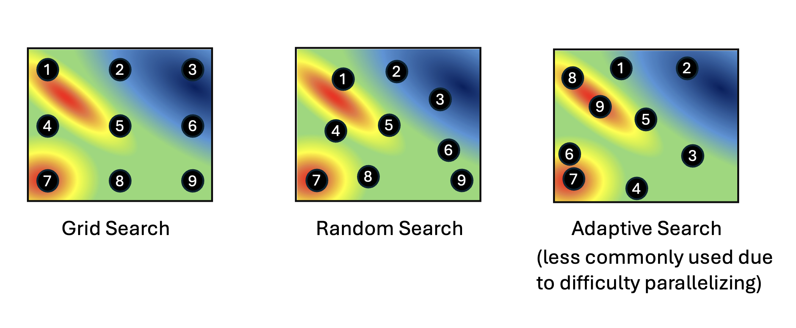
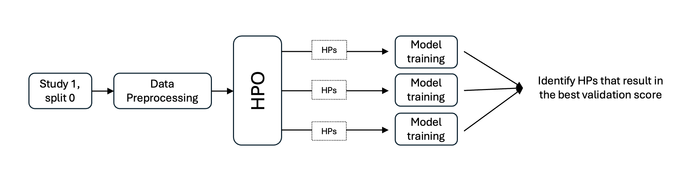

Hyper Parameter Optimization (HPO) Workflows
================================================

Hyperparameters are pre-specified parameters in deep learning models that control the learning process. 
Examples of commonly fine-tuned hyperparameters include learning rate, batch size, dropout, or number of layers.
The values of these hyperparamers are fixed before training begins, but these hyperparameters can affect performance of the model.
Hyper Parameter Optimization (HPO) determines which hyperparameters produce the best model for a given dataset by minimizing validation loss. 
Common techniques for HPO include the more computationally intensive Grid Search and Random Search, as well as newer, more efficient 
Adaptive Search methods such as Bayesian Optimization and Genetic Algorithms.

   HPO techniques

We have currently have a workflow for HPO based on Bayesian Optimization, :doc:`DeepHyper HPO <using_hpo_deephyper>`.

Workflow
------------
A workflow for HPO consists of first running preprocessing for the study and split you would like to determine optimized hyperparameters 
for. Then the HPO workflow can be run with this preprocessed data. The workflow will run training repeatedly using the model *train* script 
for the hyperparameters and hyperparameter ranges specified. The model with the best validation scores is considered to be hyperparameter optimized.

   HPO workflow 

Metrics
------------
HPO workflows report the validation loss (usually MSE) for each set of hyperparameters tested.

.. toctree::
   :titlesonly:

   DeepHyper HPO <using_hpo_deephyper>
 