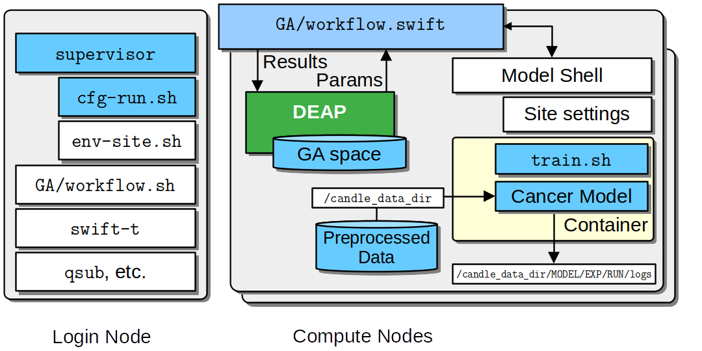

Hyper Parameter Optimization (HPO)
==================================

    The above figure provides an overview of the newer tool-driven approach using the `supervisor` command-line tool with `cfg` scripts and `SUPERVISOR_PATH`. Login and Compute node internals show the DEAP-driven Genetic Algorithm (GA) workflow for Hyperparameter Optimization (HPO) on any supercomputer.
    **Color Coding**: Blue boxes indicate user edits, while white boxes are primarily provided by Supervisor.

.. toctree::
   :titlesonly:

   HPO Prerequisites <using_hpo_prerequisites>
   HPO Requirements <using_hpo_req>
   HPO Parameters <using_hpo_parameters>
   HPO without Containers <using_hpo-debug-without-containers-lambda>

Requirements
____________

The following are the requirements to run HPO on your model.

Your model must be IMPROVE compliant, containerized, and packaged in a singularity image. You can identify the image file by the **\*.sif** suffix. Default definition files can be found in the `IMPROVE Singularity repository <https://github.com/JDACS4C-IMPROVE/Singularity>`_. The container should expose the following interface scripts:

+ preprocess.sh
+ train.sh
+ infer.sh

Steps 
_____

1. Install prerequisites
2. Preprocess data
3. :ref:`Create config files <Config Overview>` for experiment. 
4. :ref:`Run <Run>` HPO with supervisor::
        supervisor ${location} ${workflow} ${config}
4. :ref:`Analysis <Analysis>`

.. Install Prerequisites:

Install Prerequisites
___________________

Refer to the :ref:`Prerequisites Guide <using_hpo_prerequisites>`

.. _Preprocess Data:

Preprocess Data
___________________

This step is only necessary if your data has not already been preprocessed and stored on your filesystem. To preprocess your data, you'll need to call ``preprocess.sh`` in your singularity container with the needed command line arguments. Preprocess using the following command with your arguments:

.. code-block:: bash

    singularity exec --bind $IMPROVE_DATA_DIR:/IMPROVE_DATA_DIR <path_to_sif_file>.sif preprocess.sh /IMPROVE_DATA_DIR --train_split_file <dataset>_split_0_train.txt \
    --val_split_file <dataset>_split_0_val.txt --ml_data_outdir /IMPROVE_DATA_DIR/<desired_outdir>

.. _Config Overview:

Create config files
___________________

A directory with copy-and-customize config files here at `Example Files <https://github.com/ECP-CANDLE/Tests/tree/main/sv-tool/deap-generic>`_, along with a `README <https://github.com/ECP-CANDLE/Tests/blob/main/sv-tool/deap-generic/README.adoc>`_ that explains the settings used. Create with the following steps:

1. ``mkdir Experiment && cd Experiment``

2. Create config file *cfg-1.sh*:

   .. code-block:: bash

    source_cfg -v cfg-my-settings.sh
    
    export CANDLE_MODEL_TYPE="SINGULARITY"
    export MODEL_NAME=${/PATH/TO/SINGULARITY/IMAGE/FILE.sif}
    export PARAM_SET_FILE=${/PATH/TO/GA/PARAMETER/FILE.json} #e.g hyperparams.json

3. Create config file *cfg-my-settings.sh*:

   .. code-block:: bash

    echo SETTINGS
    
    # General Settings
    export PROCS=4
    export PPN=4
    export WALLTIME=01:00:00
    export NUM_ITERATIONS=3
    export POPULATION_SIZE=2
    
    # GA Settings (optional)
    export GA_STRATEGY='mu_plus_lambda'
    export OFFSPRING_PROPORTION=0.5
    export MUT_PROB=0.8
    export CX_PROB=0.2
    export MUT_INDPB=0.5
    export CX_INDPB=0.5
    export TOURNSIZE=4

    # Add any additional settings needed for your system. General settings and system settings need to be set by the user, while GA settings don't need to be changed.
    # Default settings for lambda and polaris are given here. 

    # If you have write access to the shared filesystem on your computation system (such as /lambda_stor), 
    # you can save there. If not, make a directory in /tmp or somewhere else you can write.

    # Lambda Settings
    # export CANDLE_DATA_DIR=/tmp/<user>/data_dir
    
    # Polaris Settings
    # export QUEUE="debug"
    # export CANDLE_DATA_DIR=/home/<user>/data_dir

More information on Polaris job submitting (nodes, walltime, queue, etc...) can be found here: https://docs.alcf.anl.gov/polaris/running-jobs/

4. Create parameter file *hyperparams.json*:

    .. code-block:: JSON

        [

          {
            "name": "train_ml_data_dir",
            "type": "constant",
            "value": "<train_data_dir>"
          },
          {
            "name": "val_ml_data_dir",
            "type": "constant",
            "value": "<val_data_dir>"
          },
          {
            "name": "model_outdir",
            "type": "constant",
            "value": "<desired_outdir>"
          },

          {
            "name": "learning_rate",
            "type": "float",
            "use_log_scale": true,
            "lower": 0.000001,
            "upper": 0.0001
          },
          {
            "name": "num_layers",
            "type": "int",
            "lower": 1,
            "upper": 9
          },
          {
            "name": "batch_size",
            "type": "ordered",
            "element_type": "int",
            "values": [16, 32, 64, 128, 256, 512],
            "sigma": 1
          },
          {
            "name": "warmup_type",
            "type": "ordered",
            "element_type": "string",
            "values": ["none", "linear", "quadratic", "exponential"],
            "sigma": 0.5
          },
          {
            "name": "optimizer",
            "type": "categorical",
            "element_type": "string",
            "values": [
              "Adam",
              "SGD",
              "RMSprop"
            ]
          },

          {
            "name": "epochs",
            "type": "constant",
            "value": 150
          }
        
        ]

Make sure to set the hyperparameter space to what you desire, the above file is an example. The upper and lower describe the bounds of the hyperparameter. Hyperparameters of float, int, ordered, categorical, and constant types are supported, with ordered and categorical hyperparameters supporting float, int, and string types. Log scale exploration is also supported for float and int hyperparameter types. More about additional customization and methods can be found in the `HPO Parameters Guide <using_hpo_prerequisites>`_.

Supervisor setup
________________

Supervisor is built on the Swift/T workflow language and the EMEWS Framework.

Supervisor is pre-installed on many relevant HPC systems.  In these cases, you simply have to select the previously-developed "site" configuration already available.

If not already installed, follow these steps:

.. code-block:: bash

    # Create environment
    conda create --name IMPROVE python=3.9.16
    conda activate IMPROVE

    # Supervisor for running HPO/GA
    git clone https://github.com/ECP-CANDLE/Supervisor.git
    git checkout develop
    cd Supervisor && PATH=$PATH:$(pwd)/bin

    # swift-t
    conda install --yes -c conda-forge -c swift-t swift-t
    # python libraries
    pip install numpy deap

Note that on clusters with specific MPI implementations, you must build Swift/T: https://swift-lang.github.io/swift-t/guide.html#_installation

Example
_______

First, go into the directory where you have your configuration files:

.. code-block:: bash

    cd ~/Experiment

Then, run the command:

.. code-block:: bash

    supervisor ${location} ${workflow} ${config}

Running an HPO experiment on lambda. The model image is in */software/improve/images/*. We will execute the command above with **location** set to *conda* and **workflow** set to *GA*. This will use the defaults from your conda environment.

.. code-block:: bash

    supervisor conda GA cfg-1.sh

Debugging
_______

While/after running HPO, there will be ``model.log`` files which contain the important information regarding that model's run. They can be found at ``<candle_data_dir>/<model_name>/Output/EXP<number>/run_<number>``. To debug, use a ``grep -r "ABORT"`` in the experiment directory ``<candle_data_dir>/<model_name>/Output/EXP<number>`` to find which run file which is causing the error in your workflow, ``cd run_<number>`` to navigate there, and ``cat model.log`` to observe the abort and what error caused it. Observing the ``MODEL_CMD`` (which tells the hyperparameters) and the ``IMPROVE_RESULT`` (which tells the  evaluation of those hyperparameters) can also be helpful.

Results
_______

After running HPO, there will be the turbine output and experiment directories. The ``turbine_output`` directory is found in the same directory as the config files and contains a ``final_result_<number>`` file which puts the HPO results in a table. The experiment directory is found at ``<candle_data_dir>/<model_name>/Output/EXP<number>`` and contains the ``output.csv`` file which has ALL the hpo parameters and results automatically parsed. The experiment directory also contains the hyperparams.json file you used to help remember the hyperparameter space you explored.

.. _Analysis:

Analysis
_______

To analyze the HPO run, there are two recommended methods. The first provides a ranking of hyperparameter choices. The second provides a ranking and visualization:

(1) Firstly, the user could run the following commands in the experiment directory. The user is required to define the number of hyperparameters. In the example hyperparams.json file given, this would be 3 (learning_rate, batch_size, epochs). The sorted, unique choices of hyperparameters are put into a new ``sorted_unique_output.csv`` file.

.. code-block:: bash

    num_hyperparams=3
    num_columns=$((num_hyperparams + 1))
    (head -n 1 output.csv && tail -n +2 output.csv | sort -t, -k$num_columns -n | uniq) > sorted_unique_output.csv

(2) Secondly, the user could secure copy the output.csv file, then use google colab to show tables and plot. The secure copy command should be run in your terminal (not logged into Argonne's computation system) as the following: ``scp <user>@<computation_address>:~/path/to/your/output.csv \path\on\local\computer``. For example, as secure copy command could look like: ``scp <username>r@polaris.alcf.anl.gov:~/data_dir/DeepTTC-testing/Output/finished_EXP060/output.csv \Users\<username>\Argonne\HPO``. Note that this assumes the user is using Unix. If running a Unix-like system on Windows, the command will look like ``scp <user>@<computation_address>:~/path/to/your/output.csv /c/Users/username/Path/On/Local/Computer``.

Once the file is secure copied to your local computer, it can be loaded into and used in google colab. For an example, follow the example and instructions here: https://colab.research.google.com/drive/1Us5S9Ty7qGtibT5TcwM9rTE7EIA9V33t?usp=sharing
