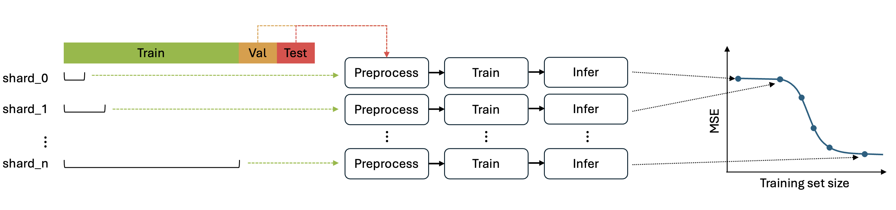

Learning Curve Analysis Workflows
====================================

Learning curve analysis (LCA) allows to evaluate how prediction performance improves as the training set size increases, providing insights into the model's data scaling properties.

Workflow
---------
The LCA workflow takes training data (referred to as training shards) created by :doc:`using_lc_generate_splits` and runs *preprocess*, *train*, and *infer* 
for all available training shards, with all specified splits for a given dataset.

   Learning Curve Analysis workflow for analyzing a single split

Metrics
--------
The inference scores resulting from each training shard can be aggregated and plotted using :doc:`using_lc_postprocess`. 
When the right tail of the curve flattens, the model performance is no longer improving with additional training data.

References
-------------
`1. <https://link.springer.com/article/10.1186/s12859-021-04163-y>`_ A. Partin et al. "Learning curves for drug response prediction in cancer cell lines", BMC Bioinformatics, 2021

.. toctree::
   :titlesonly:

   Generate LCA Splits <using_lc_generate_splits>
   Brute-Force LCA <using_lc_bruteforce>
   Swarm LCA <using_lc_swarm>
   Post-process LCA Results <using_lc_postprocess>